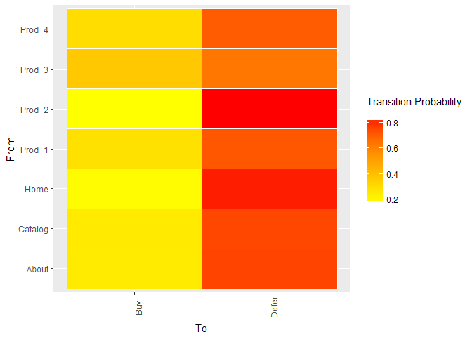

Clickstream-measurecamp
================
Alexandros Papageorgiou
17/3/2018

-   [Set-up](#set-up)
-   [Simulate Clickstream data](#simulate-clickstream-data)
    -   [Matrix with transition probs](#matrix-with-transition-probs)
    -   [Transition data frame](#transition-data-frame)
-   [Generate random clickstream](#generate-random-clickstream)
    -   [Cls summary](#cls-summary)
    -   [Clickstream Data Frame](#clickstream-data-frame)
-   [EDA](#eda)
    -   [Frequent user paths](#frequent-user-paths)
    -   [common path to conversion](#common-path-to-conversion)
-   [common path to non-conversion](#common-path-to-non-conversion)
-   [clustering](#clustering)
    -   [Prepare object](#prepare-object)
    -   [Call k-means algo](#call-k-means-algo)
    -   [cluster summary](#cluster-summary)
    -   [cluster 1 sample](#cluster-1-sample)
    -   [cluster 2 sample](#cluster-2-sample)
-   [Markov Chain Model](#markov-chain-model)
    -   [fitMarkovChain](#fitmarkovchain)
    -   [transition probabilities](#transition-probabilities)
-   [Next click pred](#next-click-pred)
-   [Plots](#plots)
    -   [Directed Network graph](#directed-network-graph)
    -   [Heatmap](#heatmap)
    -   [Heatmap for absorption states](#heatmap-for-absorption-states)
-   [Association rules](#association-rules)
    -   [cls to frequencyDF](#cls-to-frequencydf)
    -   [CLs to transactions](#cls-to-transactions)

Set-up
======

``` r
library(tidyverse)
library(clickstream)
library(arulesSequences)
library(DT)
```

Simulate Clickstream data
=========================

-   transition probablility matrix required as input
-   additonal parameters include the avg session length and the starting probs
-   the result is converted in a data frame for easier inspection

Matrix with transition probs
----------------------------

``` r
my_matrix = matrix(c(0.01, 0.09, 0.05, 0.21, 0.12, 0.17, 0.11, 0.24, 0.00,
                     0.10, 0.00, 0.10, 0.00, 0.00, 0.00, 0.00, 0.80, 0.00,
                     0.07, 0.18, 0.13, 0.05, 0.23, 0.08, 0.26, 0.00, 0.00,
                     0.16, 0.14, 0.07, 0.00, 0.05, 0.22, 0.19, 0.10, 0.07,
                     0.24, 0.17, 0.07, 0.13, 0.00, 0.03, 0.09, 0.26, 0.01,
                     0.11, 0.18, 0.04, 0.15, 0.16, 0.00, 0.10, 0.11, 0.15,
                     0.21, 0.07, 0.08, 0.20, 0.04, 0.18, 0.02, 0.12, 0.08,
                     0.00, 0.00, 0.00, 0.00, 0.00, 0.00, 0.00, 0.00, 0.00,
                     0.00, 0.00, 0.00, 0.00, 0.00, 0.00, 0.00, 0.00, 0.00), nrow = 9 )
```

Transition data frame
---------------------

``` r
transitions <-  t(my_matrix) %>% as.data.frame()

colnames(transitions) <- c("Home", "About", "Catalog", "Prod_1", "Prod_2", "Prod_3", "Prod_4", "Defer", "Buy")

rownames(transitions)<- c("Home", "About", "Catalog", "Prod_1", "Prod_2", "Prod_3", "Prod_4", "Defer", "Buy")


print(transitions)
```

    ##         Home About Catalog Prod_1 Prod_2 Prod_3 Prod_4 Defer  Buy
    ## Home    0.01  0.09    0.05   0.21   0.12   0.17   0.11  0.24 0.00
    ## About   0.10  0.00    0.10   0.00   0.00   0.00   0.00  0.80 0.00
    ## Catalog 0.07  0.18    0.13   0.05   0.23   0.08   0.26  0.00 0.00
    ## Prod_1  0.16  0.14    0.07   0.00   0.05   0.22   0.19  0.10 0.07
    ## Prod_2  0.24  0.17    0.07   0.13   0.00   0.03   0.09  0.26 0.01
    ## Prod_3  0.11  0.18    0.04   0.15   0.16   0.00   0.10  0.11 0.15
    ## Prod_4  0.21  0.07    0.08   0.20   0.04   0.18   0.02  0.12 0.08
    ## Defer   0.00  0.00    0.00   0.00   0.00   0.00   0.00  0.00 0.00
    ## Buy     0.00  0.00    0.00   0.00   0.00   0.00   0.00  0.00 0.00

Generate random clickstream
===========================

``` r
set.seed(123)


cls <- randomClickstreams(states = c("Home", "About", "Catalog", "Prod_1", "Prod_2", "Prod_3", "Prod_4", "Defer", "Buy"),
                          startProbabilities = c(0.25, 0.10, 0.2, 0.15, 0.1, 0.1, 0.1, 0, 0),
                          transitionMatrix = my_matrix,
                          meanLength = 15, n = 10000)
```

Cls summary
-----------

``` r
summary(cls)
```

    ## Observations: 10000
    ## 
    ## Click Frequencies:
    ##   About     Buy Catalog   Defer    Home  Prod_1  Prod_2  Prod_3  Prod_4 
    ##    5053    1406    4832    8418    6865    5390    4130    4681    4957

Clickstream Data Frame
----------------------

-   optionally add session IDs
-   Where no absorbing state is specified, "defer" is added as the last step

``` r
clsdf <- tibble(random_cls=cls) %>% 
    mutate(cls_string = map_chr(random_cls, function(x) paste(unlist(x), collapse = ","))) %>% 
    mutate(cls_complete=ifelse(grepl("Defer|Buy", cls_string), cls_string, paste(cls_string, "Defer", sep=",")))


sessionIDs <- paste0("session_", seq_len(length(cls)))

clsdf$sessionID <- sessionIDs

clsdf %>% dplyr::select(sessionID, cls_complete) %>% head(10)
```

    ## # A tibble: 10 x 2
    ##    sessionID  cls_complete                                                
    ##    <chr>      <chr>                                                       
    ##  1 session_1  Prod_3,Buy                                                  
    ##  2 session_2  Prod_1,Prod_3,Buy                                           
    ##  3 session_3  Home,Defer                                                  
    ##  4 session_4  Prod_3,Prod_4,Prod_3,Buy                                    
    ##  5 session_5  Prod_1,About,Catalog,Prod_4,Defer                           
    ##  6 session_6  Catalog,Prod_4,About,Defer                                  
    ##  7 session_7  Catalog,About,Catalog,About,Defer                           
    ##  8 session_8  Catalog,Prod_4,Home,Prod_3,About,Catalog,Prod_4,Defer       
    ##  9 session_9  Catalog,Catalog,Prod_4,Prod_1,Prod_4,Defer                  
    ## 10 session_10 Prod_1,Prod_4,Home,Prod_2,Home,Prod_2,Prod_3,Prod_1,Home,Pr~

EDA
===

Frequent user paths
-------------------

``` r
clsdf %>% rename(user_path=cls_complete) %>% 
  count(user_path) %>% 
  ungroup %>%  
  mutate(freq=n/sum(n)) %>% 
  arrange(desc(freq)) %>% 
  slice(1:20) %>% 
  mutate_if(is.numeric, round, digits=3) %>%  
  datatable()
```

<!--html_preserve-->

<script type="application/json" data-for="htmlwidget-6956e4feee2f6f66156c">{"x":{"filter":"none","data":[["1","2","3","4","5","6","7","8","9","10","11","12","13","14","15","16","17","18","19","20"],["About,Defer","Home,Defer","Catalog,About,Defer","Prod_2,Defer","Home,About,Defer","Prod_1,About,Defer","Prod_3,About,Defer","Prod_3,Buy","Prod_1,Defer","Prod_2,About,Defer","Catalog,Prod_2,Defer","Prod_4,Defer","Prod_1,Buy","Prod_4,Buy","Home,Prod_2,Defer","Prod_3,Defer","Home,Prod_3,About,Defer","Home,Prod_1,About,Defer","Catalog,Prod_4,Defer","Home,Prod_1,Defer"],[791,587,308,285,176,167,151,140,139,134,118,110,90,84,83,81,70,67,64,61],[0.079,0.059,0.031,0.028,0.018,0.017,0.015,0.014,0.014,0.013,0.012,0.011,0.009,0.008,0.008,0.008,0.007,0.007,0.006,0.006]],"container":"<table class=\"display\">\n  <thead>\n    <tr>\n      <th> <\/th>\n      <th>user_path<\/th>\n      <th>n<\/th>\n      <th>freq<\/th>\n    <\/tr>\n  <\/thead>\n<\/table>","options":{"columnDefs":[{"className":"dt-right","targets":[2,3]},{"orderable":false,"targets":0}],"order":[],"autoWidth":false,"orderClasses":false}},"evals":[],"jsHooks":[]}</script>
<!--/html_preserve-->
common path to conversion
-------------------------

``` r
clsdf %>% rename(page_sequence=cls_complete) %>% 
  filter(grepl("Buy",page_sequence)) %>% 
  count(page_sequence) %>% 
  ungroup %>%  
  mutate(freq=n/sum(n)) %>% 
  arrange(desc(freq))  %>% slice(1:20) %>% 
  mutate_if(is.numeric, round, digits=3) %>% 
  datatable()
```

<!--html_preserve-->

<script type="application/json" data-for="htmlwidget-8896498d18bbda81c588">{"x":{"filter":"none","data":[["1","2","3","4","5","6","7","8","9","10","11","12","13","14","15","16","17","18","19","20"],["Prod_3,Buy","Prod_1,Buy","Prod_4,Buy","Home,Prod_3,Buy","Catalog,Prod_4,Buy","Prod_1,Prod_3,Buy","Home,Prod_1,Buy","Catalog,Prod_3,Buy","Prod_1,Prod_4,Buy","Prod_4,Prod_3,Buy","Home,Prod_4,Buy","Prod_4,Prod_1,Buy","Catalog,Prod_4,Prod_3,Buy","Home,Prod_1,Prod_3,Buy","Prod_1,Prod_4,Prod_3,Buy","Prod_2,Prod_1,Buy","Catalog,Prod_1,Buy","Prod_3,Prod_1,Buy","Prod_3,Prod_4,Buy","Home,Catalog,Prod_4,Buy"],[140,90,84,55,53,38,31,26,24,24,23,16,13,11,11,9,8,8,8,7],[0.1,0.064,0.06,0.039,0.038,0.027,0.022,0.018,0.017,0.017,0.016,0.011,0.009,0.008,0.008,0.006,0.006,0.006,0.006,0.005]],"container":"<table class=\"display\">\n  <thead>\n    <tr>\n      <th> <\/th>\n      <th>page_sequence<\/th>\n      <th>n<\/th>\n      <th>freq<\/th>\n    <\/tr>\n  <\/thead>\n<\/table>","options":{"columnDefs":[{"className":"dt-right","targets":[2,3]},{"orderable":false,"targets":0}],"order":[],"autoWidth":false,"orderClasses":false}},"evals":[],"jsHooks":[]}</script>
<!--/html_preserve-->
common path to non-conversion
=============================

``` r
clsdf %>% rename(page_sequence=cls_complete) %>% 
  filter(grepl("Defer",page_sequence)) %>% 
  count(page_sequence) %>% 
  ungroup %>%  
  mutate(freq=n/sum(n)) %>% 
  arrange(desc(freq))  %>% slice(1:20) %>% 
  mutate_if(is.numeric, round, digits=3) %>% 
  datatable()
```

<!--html_preserve-->

<script type="application/json" data-for="htmlwidget-c5053dc1fcce31a68ca7">{"x":{"filter":"none","data":[["1","2","3","4","5","6","7","8","9","10","11","12","13","14","15","16","17","18","19","20"],["About,Defer","Home,Defer","Catalog,About,Defer","Prod_2,Defer","Home,About,Defer","Prod_1,About,Defer","Prod_3,About,Defer","Prod_1,Defer","Prod_2,About,Defer","Catalog,Prod_2,Defer","Prod_4,Defer","Home,Prod_2,Defer","Prod_3,Defer","Home,Prod_3,About,Defer","Home,Prod_1,About,Defer","Catalog,Prod_4,Defer","Home,Prod_1,Defer","Prod_1,Prod_3,About,Defer","Catalog,Prod_2,About,Defer","Home,Prod_3,Defer"],[791,587,308,285,176,167,151,139,134,118,110,83,81,70,67,64,61,54,53,51],[0.092,0.068,0.036,0.033,0.02,0.019,0.018,0.016,0.016,0.014,0.013,0.01,0.009,0.008,0.008,0.007,0.007,0.006,0.006,0.006]],"container":"<table class=\"display\">\n  <thead>\n    <tr>\n      <th> <\/th>\n      <th>page_sequence<\/th>\n      <th>n<\/th>\n      <th>freq<\/th>\n    <\/tr>\n  <\/thead>\n<\/table>","options":{"columnDefs":[{"className":"dt-right","targets":[2,3]},{"orderable":false,"targets":0}],"order":[],"autoWidth":false,"orderClasses":false}},"evals":[],"jsHooks":[]}</script>
<!--/html_preserve-->
clustering
==========

Prepare object
--------------

``` r
cls_list <- clsdf %>% mutate(cls=map(cls_complete, function(x) unlist(strsplit(x, split = ",")))) 


cls_final <- cls_list$cls


class(cls_final) <- "Clickstreams"
```

Call k-means algo
-----------------

``` r
clusters <- clusterClickstreams(clickstreamList = cls_final, order = 1, centers = 2) 
```

show example of the clickstream in the given cluster.

cluster summary
---------------

``` r
summary(clusters$clusters[[1]]) 
```

    ## Observations: 4005
    ## 
    ## Click Frequencies:
    ##   About Catalog   Defer    Home  Prod_1  Prod_2  Prod_3  Prod_4 
    ##    4328    1988    4005    2007    1766    1247    1506    1393

cluster 1 sample
----------------

``` r
sample(clusters[[1]][[1]],size = 10)
```

    ## [[1]]
    ## [1] "Prod_1" "About"  "Defer" 
    ## 
    ## [[2]]
    ## [1] "Catalog" "Prod_4"  "Prod_3"  "Prod_1"  "Catalog" "About"   "Defer"  
    ## 
    ## [[3]]
    ## [1] "Prod_1" "Prod_3" "Prod_2" "About"  "Defer" 
    ## 
    ## [[4]]
    ## [1] "Home"   "Prod_1" "About"  "Defer" 
    ## 
    ## [[5]]
    ## [1] "Catalog" "Prod_2"  "Home"    "Prod_2"  "About"   "Defer"  
    ## 
    ## [[6]]
    ## [1] "Prod_4"  "Prod_2"  "Home"    "Catalog" "Catalog" "About"   "Defer"  
    ## 
    ## [[7]]
    ## [1] "Home"  "About" "Defer"
    ## 
    ## [[8]]
    ## [1] "Prod_1"  "Catalog" "Prod_3"  "Prod_2"  "Home"    "Prod_4"  "Prod_3" 
    ## [8] "About"   "Defer"  
    ## 
    ## [[9]]
    ## [1] "Home"   "Prod_1" "About"  "Defer" 
    ## 
    ## [[10]]
    ## [1] "Prod_1" "About"  "Defer"

cluster 2 sample
----------------

``` r
sample(clusters[[1]][[2]],size = 10)
```

    ## [[1]]
    ## [1] "Prod_2" "Defer" 
    ## 
    ## [[2]]
    ## [1] "Prod_1" "Prod_3" "Home"   "Prod_2" "Defer" 
    ## 
    ## [[3]]
    ## [1] "Home"  "Defer"
    ## 
    ## [[4]]
    ## [1] "Home"  "Defer"
    ## 
    ## [[5]]
    ##  [1] "Prod_4"  "Prod_1"  "Prod_4"  "Prod_1"  "Home"    "Prod_1"  "About"  
    ##  [8] "Catalog" "Prod_4"  "Buy"    
    ## 
    ## [[6]]
    ## [1] "Catalog" "Prod_4"  "Prod_3"  "Defer"  
    ## 
    ## [[7]]
    ## [1] "Home"   "Prod_4" "Prod_4" "Home"   "Defer" 
    ## 
    ## [[8]]
    ## [1] "Prod_2" "Defer" 
    ## 
    ## [[9]]
    ## [1] "Home"   "Prod_1" "Home"   "Defer" 
    ## 
    ## [[10]]
    ## [1] "Prod_3" "Prod_4" "Home"   "Prod_3" "Buy"

Markov Chain Model
==================

fitMarkovChain
--------------

``` r
cluster_two <- clusters$clusters[[2]]

mc <- fitMarkovChain(clickstreamList =cluster_two , order = 1)

summary(mc)
```

    ## First-Order Markov Chain with 9 states.
    ##  The Markov Chain has absorbing states.
    ## 
    ## Observations: 27668
    ## LogLikelihood: -38591.17
    ## AIC: 77202.33
    ## BIC: 77284.61

transition probabilities
------------------------

``` r
print(mc)
```

    ## First-Order Markov Chain
    ## 
    ## Transition Probabilities:
    ## 
    ## Lag:  1 
    ## lambda:  1 
    ##              About Buy     Catalog Defer        Home     Prod_1     Prod_2
    ## About   0.00000000   0 0.043600563     0 0.019143681 0.02621413 0.03260493
    ## Buy     0.00000000   0 0.000000000     0 0.000000000 0.09050773 0.01422130
    ## Catalog 0.45379310   0 0.132559775     0 0.043227666 0.06125828 0.05931322
    ## Defer   0.01517241   0 0.005977496     0 0.342116097 0.16307947 0.39334027
    ## Home    0.53103448   0 0.078410689     0 0.007822149 0.16997792 0.24835241
    ## Prod_1  0.00000000   0 0.048874824     0 0.201111569 0.00000000 0.13319459
    ## Prod_2  0.00000000   0 0.272151899     0 0.122890078 0.05022075 0.00000000
    ## Prod_3  0.00000000   0 0.100914205     0 0.157266365 0.21964680 0.02913632
    ## Prod_4  0.00000000   0 0.317510549     0 0.106422396 0.21909492 0.08983698
    ##             Prod_3     Prod_4
    ## About   0.04157480 0.01262626
    ## Buy     0.20976378 0.10409652
    ## Catalog 0.03685039 0.07098765
    ## Defer   0.16850394 0.17929293
    ## Home    0.12283465 0.21156004
    ## Prod_1  0.15370079 0.19163861
    ## Prod_2  0.16598425 0.03619529
    ## Prod_3  0.00000000 0.17059484
    ## Prod_4  0.10078740 0.02300786
    ## 
    ## Start Probabilities:
    ## 
    ##      About    Catalog       Home     Prod_1     Prod_2     Prod_3 
    ## 0.02368641 0.19432861 0.28957465 0.15896580 0.11242702 0.10608841 
    ##     Prod_4 
    ## 0.11492911 
    ## 
    ## End Probabilities:
    ## 
    ##       Buy     Defer 
    ## 0.2345288 0.7654712

Next click pred
===============

``` r
pattern <- new("Pattern", sequence = c("Prod_3", "Prod_1"),
               absorbingProbabilities = data.frame(Buy = 0.2345288, Defer = 0.7654712))


resultPattern <- predict(mc, startPattern = pattern, dist = 2)

resultPattern
```

    ## Sequence: Prod_4 Home
    ## Probability: 0.05106156
    ## Absorbing Probabilities: 
    ##          Buy     Defer
    ## 1 0.02601113 0.9739889

Plots
=====

Directed Network graph
----------------------

``` r
plot(mc, order = 1, minProbability = 0.09)
```


Heatmap
-------

``` r
hmPlot(mc )
```


Heatmap for absorption states
-----------------------------

``` r
hmPlot(mc, absorptionProbability = T )
```



Association rules
=================

cls to frequencyDF
------------------

``` r
frequencyDF <- frequencies(cls)

head(frequencyDF, 10)
```

    ##    Prod_3 Buy Prod_1 Home Defer Prod_4 About Catalog Prod_2
    ## 1       1   1      0    0     0      0     0       0      0
    ## 2       1   1      1    0     0      0     0       0      0
    ## 3       0   0      0    1     1      0     0       0      0
    ## 4       2   1      0    0     0      1     0       0      0
    ## 5       0   0      1    0     1      1     1       1      0
    ## 6       0   0      0    0     1      1     1       1      0
    ## 7       0   0      0    0     1      0     2       2      0
    ## 8       1   0      0    1     1      2     1       2      0
    ## 9       0   0      1    0     1      2     0       2      0
    ## 10      1   0      4    4     0      3     0       0      2

CLs to transactions
-------------------

``` r
trans <- as.transactions(cls)


sequences <- as(cspade(trans, parameter = list(support = 0.3)), "data.frame")


sequences
```

    ##              sequence support
    ## 1           <{About}>  0.4653
    ## 2         <{Catalog}>  0.3511
    ## 3           <{Defer}>  0.8418
    ## 4            <{Home}>  0.5089
    ## 5          <{Prod_1}>  0.4110
    ## 6          <{Prod_2}>  0.3446
    ## 7          <{Prod_3}>  0.3781
    ## 8          <{Prod_4}>  0.3783
    ## 9   <{About},{Defer}>  0.4445
    ## 10   <{Home},{Defer}>  0.4340
    ## 11 <{Prod_1},{Defer}>  0.3194
    ## 12 <{Prod_2},{Defer}>  0.3002
