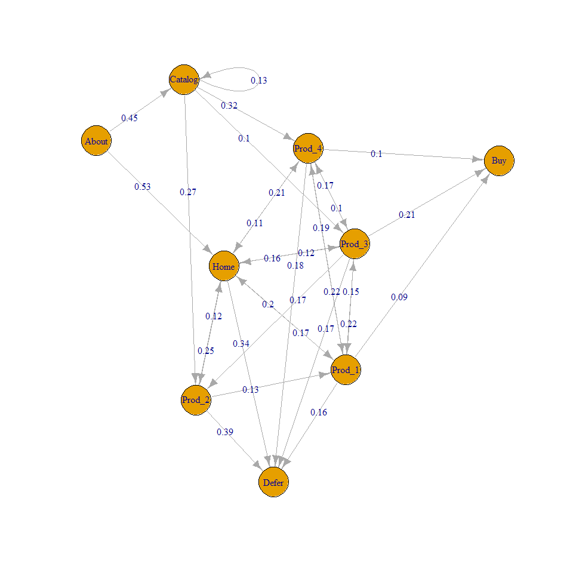
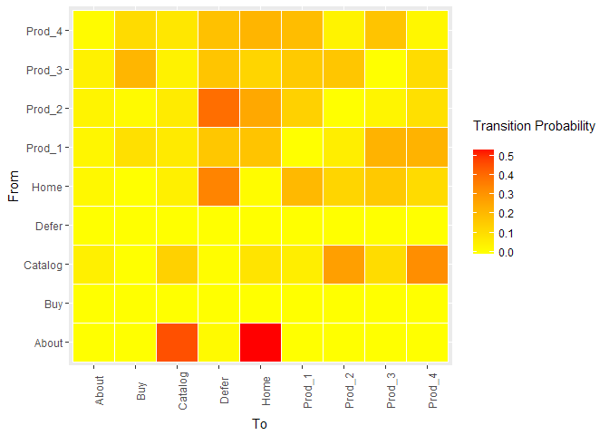

Clickstream analytics @ Data Sci & Eng meetup
================
Alexandros Papageorgiou
26/5/2018

-   [Set-up](#set-up)
-   [Simulate Clickstream data](#simulate-clickstream-data)
    -   [Matrix with transition probs](#matrix-with-transition-probs)
    -   [Transition data frame](#transition-data-frame)
-   [Generate random clickstream](#generate-random-clickstream)
    -   [Cls summary](#cls-summary)
    -   [Clickstream Data Frame](#clickstream-data-frame)
-   [Frequent Paths](#frequent-paths)
    -   [Frequent user paths](#frequent-user-paths)
    -   [Frequent paths to conversion](#frequent-paths-to-conversion)
-   [Frequent paths to non-conversion](#frequent-paths-to-non-conversion)
-   [Clustering](#clustering)
    -   [Prepare object](#prepare-object)
    -   [Call k-means algo](#call-k-means-algo)
    -   [cluster summary](#cluster-summary)
    -   [cluster 1 sample](#cluster-1-sample)
    -   [cluster 2 sample](#cluster-2-sample)
-   [Markov Chain Model](#markov-chain-model)
    -   [fitMarkovChain](#fitmarkovchain)
    -   [transition probabilities](#transition-probabilities)
-   [Next click pred](#next-click-pred)
-   [Visualisation](#visualisation)
    -   [Directed Network graph](#directed-network-graph)
    -   [Heatmap](#heatmap)
    -   [Heatmap for absorbing states](#heatmap-for-absorbing-states)

Set-up
======

``` r
library(tidyverse)
library(clickstream)
library(arulesSequences)
library(DT)
```

Simulate Clickstream data
=========================

-   transition probablility matrix required as input
-   additonal parameters include the avg session length and the starting probs
-   the result is converted in a data frame for easier inspection

Matrix with transition probs
----------------------------

``` r
my_matrix = matrix(c(0.01, 0.09, 0.05, 0.21, 0.12, 0.17, 0.11, 0.24, 0.00,
                     0.10, 0.00, 0.10, 0.00, 0.00, 0.00, 0.00, 0.80, 0.00,
                     0.07, 0.18, 0.13, 0.05, 0.23, 0.08, 0.26, 0.00, 0.00,
                     0.16, 0.14, 0.07, 0.00, 0.05, 0.22, 0.19, 0.10, 0.07,
                     0.24, 0.17, 0.07, 0.13, 0.00, 0.03, 0.09, 0.26, 0.01,
                     0.11, 0.18, 0.04, 0.15, 0.16, 0.00, 0.10, 0.11, 0.15,
                     0.21, 0.07, 0.08, 0.20, 0.04, 0.18, 0.02, 0.12, 0.08,
                     0.00, 0.00, 0.00, 0.00, 0.00, 0.00, 0.00, 0.00, 0.00,
                     0.00, 0.00, 0.00, 0.00, 0.00, 0.00, 0.00, 0.00, 0.00), nrow = 9 )
```

Transition data frame
---------------------

``` r
transitions <-  t(my_matrix) %>% as.data.frame()

colnames(transitions) <- c("Home", "About", "Catalog", "Prod_1", "Prod_2", "Prod_3", "Prod_4", "Defer", "Buy")

rownames(transitions)<- c("Home", "About", "Catalog", "Prod_1", "Prod_2", "Prod_3", "Prod_4", "Defer", "Buy")


print(transitions)
```

    ##         Home About Catalog Prod_1 Prod_2 Prod_3 Prod_4 Defer  Buy
    ## Home    0.01  0.09    0.05   0.21   0.12   0.17   0.11  0.24 0.00
    ## About   0.10  0.00    0.10   0.00   0.00   0.00   0.00  0.80 0.00
    ## Catalog 0.07  0.18    0.13   0.05   0.23   0.08   0.26  0.00 0.00
    ## Prod_1  0.16  0.14    0.07   0.00   0.05   0.22   0.19  0.10 0.07
    ## Prod_2  0.24  0.17    0.07   0.13   0.00   0.03   0.09  0.26 0.01
    ## Prod_3  0.11  0.18    0.04   0.15   0.16   0.00   0.10  0.11 0.15
    ## Prod_4  0.21  0.07    0.08   0.20   0.04   0.18   0.02  0.12 0.08
    ## Defer   0.00  0.00    0.00   0.00   0.00   0.00   0.00  0.00 0.00
    ## Buy     0.00  0.00    0.00   0.00   0.00   0.00   0.00  0.00 0.00

Generate random clickstream
===========================

``` r
set.seed(123)


cls <- randomClickstreams(states = c("Home", "About", "Catalog", "Prod_1", "Prod_2", "Prod_3", "Prod_4", "Defer", "Buy"),
                          startProbabilities = c(0.25, 0.10, 0.2, 0.15, 0.1, 0.1, 0.1, 0, 0),
                          transitionMatrix = my_matrix,
                          meanLength = 15, n = 10000)
```

Cls summary
-----------

``` r
summary(cls)
```

    ## Observations: 10000
    ## 
    ## Click Frequencies:
    ##   About     Buy Catalog   Defer    Home  Prod_1  Prod_2  Prod_3  Prod_4 
    ##    5053    1406    4832    8418    6865    5390    4130    4681    4957

Clickstream Data Frame
----------------------

-   optionally add session IDs
-   Where no absorbing state is specified, "defer" is added as the last step

``` r
clsdf <- tibble(random_cls=cls) %>% 
    mutate(cls_string = map_chr(random_cls, function(x) paste(unlist(x), collapse = ","))) %>% 
    mutate(cls_complete=ifelse(grepl("Defer|Buy", cls_string), cls_string, paste(cls_string, "Defer", sep=",")))


sessionIDs <- paste0("session_", seq_len(length(cls)))

clsdf$sessionID <- sessionIDs

clsdf %>% dplyr::select(sessionID, cls_complete) %>% head(10)
```

    ## # A tibble: 10 x 2
    ##    sessionID  cls_complete                                                
    ##    <chr>      <chr>                                                       
    ##  1 session_1  Prod_3,Buy                                                  
    ##  2 session_2  Prod_1,Prod_3,Buy                                           
    ##  3 session_3  Home,Defer                                                  
    ##  4 session_4  Prod_3,Prod_4,Prod_3,Buy                                    
    ##  5 session_5  Prod_1,About,Catalog,Prod_4,Defer                           
    ##  6 session_6  Catalog,Prod_4,About,Defer                                  
    ##  7 session_7  Catalog,About,Catalog,About,Defer                           
    ##  8 session_8  Catalog,Prod_4,Home,Prod_3,About,Catalog,Prod_4,Defer       
    ##  9 session_9  Catalog,Catalog,Prod_4,Prod_1,Prod_4,Defer                  
    ## 10 session_10 Prod_1,Prod_4,Home,Prod_2,Home,Prod_2,Prod_3,Prod_1,Home,Pr~

Frequent Paths
==============

Frequent user paths
-------------------

``` r
clsdf %>% rename(user_path=cls_complete) %>% 
  count(user_path) %>% 
  ungroup %>%  
  mutate(freq=n/sum(n)) %>% 
  arrange(desc(freq)) %>% 
  slice(1:20) %>% 
  mutate_if(is.numeric, round, digits=3)
```

    ## # A tibble: 20 x 3
    ##    user_path                   n    freq
    ##    <chr>                   <dbl>   <dbl>
    ##  1 About,Defer              791. 0.0790 
    ##  2 Home,Defer               587. 0.0590 
    ##  3 Catalog,About,Defer      308. 0.0310 
    ##  4 Prod_2,Defer             285. 0.0280 
    ##  5 Home,About,Defer         176. 0.0180 
    ##  6 Prod_1,About,Defer       167. 0.0170 
    ##  7 Prod_3,About,Defer       151. 0.0150 
    ##  8 Prod_3,Buy               140. 0.0140 
    ##  9 Prod_1,Defer             139. 0.0140 
    ## 10 Prod_2,About,Defer       134. 0.0130 
    ## 11 Catalog,Prod_2,Defer     118. 0.0120 
    ## 12 Prod_4,Defer             110. 0.0110 
    ## 13 Prod_1,Buy                90. 0.00900
    ## 14 Prod_4,Buy                84. 0.00800
    ## 15 Home,Prod_2,Defer         83. 0.00800
    ## 16 Prod_3,Defer              81. 0.00800
    ## 17 Home,Prod_3,About,Defer   70. 0.00700
    ## 18 Home,Prod_1,About,Defer   67. 0.00700
    ## 19 Catalog,Prod_4,Defer      64. 0.00600
    ## 20 Home,Prod_1,Defer         61. 0.00600

Frequent paths to conversion
----------------------------

``` r
clsdf %>% rename(page_sequence=cls_complete) %>% 
  filter(grepl("Buy",page_sequence)) %>% 
  count(page_sequence) %>% 
  ungroup %>%  
  mutate(freq=n/sum(n)) %>% 
  arrange(desc(freq))  %>% slice(1:20) %>% 
  mutate_if(is.numeric, round, digits=3) 
```

    ## # A tibble: 20 x 3
    ##    page_sequence                 n    freq
    ##    <chr>                     <dbl>   <dbl>
    ##  1 Prod_3,Buy                 140. 0.100  
    ##  2 Prod_1,Buy                  90. 0.0640 
    ##  3 Prod_4,Buy                  84. 0.0600 
    ##  4 Home,Prod_3,Buy             55. 0.0390 
    ##  5 Catalog,Prod_4,Buy          53. 0.0380 
    ##  6 Prod_1,Prod_3,Buy           38. 0.0270 
    ##  7 Home,Prod_1,Buy             31. 0.0220 
    ##  8 Catalog,Prod_3,Buy          26. 0.0180 
    ##  9 Prod_1,Prod_4,Buy           24. 0.0170 
    ## 10 Prod_4,Prod_3,Buy           24. 0.0170 
    ## 11 Home,Prod_4,Buy             23. 0.0160 
    ## 12 Prod_4,Prod_1,Buy           16. 0.0110 
    ## 13 Catalog,Prod_4,Prod_3,Buy   13. 0.00900
    ## 14 Home,Prod_1,Prod_3,Buy      11. 0.00800
    ## 15 Prod_1,Prod_4,Prod_3,Buy    11. 0.00800
    ## 16 Prod_2,Prod_1,Buy            9. 0.00600
    ## 17 Catalog,Prod_1,Buy           8. 0.00600
    ## 18 Prod_3,Prod_1,Buy            8. 0.00600
    ## 19 Prod_3,Prod_4,Buy            8. 0.00600
    ## 20 Home,Catalog,Prod_4,Buy      7. 0.00500

Frequent paths to non-conversion
================================

``` r
clsdf %>% rename(page_sequence=cls_complete) %>% 
  filter(grepl("Defer",page_sequence)) %>% 
  count(page_sequence) %>% 
  ungroup %>%  
  mutate(freq=n/sum(n)) %>% 
  arrange(desc(freq))  %>% slice(1:20) %>% 
  mutate_if(is.numeric, round, digits=3) 
```

    ## # A tibble: 20 x 3
    ##    page_sequence                  n    freq
    ##    <chr>                      <dbl>   <dbl>
    ##  1 About,Defer                 791. 0.0920 
    ##  2 Home,Defer                  587. 0.0680 
    ##  3 Catalog,About,Defer         308. 0.0360 
    ##  4 Prod_2,Defer                285. 0.0330 
    ##  5 Home,About,Defer            176. 0.0200 
    ##  6 Prod_1,About,Defer          167. 0.0190 
    ##  7 Prod_3,About,Defer          151. 0.0180 
    ##  8 Prod_1,Defer                139. 0.0160 
    ##  9 Prod_2,About,Defer          134. 0.0160 
    ## 10 Catalog,Prod_2,Defer        118. 0.0140 
    ## 11 Prod_4,Defer                110. 0.0130 
    ## 12 Home,Prod_2,Defer            83. 0.0100 
    ## 13 Prod_3,Defer                 81. 0.00900
    ## 14 Home,Prod_3,About,Defer      70. 0.00800
    ## 15 Home,Prod_1,About,Defer      67. 0.00800
    ## 16 Catalog,Prod_4,Defer         64. 0.00700
    ## 17 Home,Prod_1,Defer            61. 0.00700
    ## 18 Prod_1,Prod_3,About,Defer    54. 0.00600
    ## 19 Catalog,Prod_2,About,Defer   53. 0.00600
    ## 20 Home,Prod_3,Defer            51. 0.00600

Clustering
==========

-   This step is optional
-   Helps to improve performance of MC model in the next step

Prepare object
--------------

``` r
cls_list <- clsdf %>% mutate(cls=map(cls_complete, function(x) unlist(strsplit(x, split = ",")))) 


cls_final <- cls_list$cls


class(cls_final) <- "Clickstreams"
```

Call k-means algo
-----------------

``` r
clusters <- clusterClickstreams(clickstreamList = cls_final, order = 1, centers = 2) 
```

cluster summary
---------------

``` r
summary(clusters$clusters[[1]]) 
```

    ## Observations: 4005
    ## 
    ## Click Frequencies:
    ##   About Catalog   Defer    Home  Prod_1  Prod_2  Prod_3  Prod_4 
    ##    4328    1988    4005    2007    1766    1247    1506    1393

cluster 1 sample
----------------

``` r
sample(clusters[[1]][[1]],size = 10)
```

    ## [[1]]
    ## [1] "Prod_1" "About"  "Defer" 
    ## 
    ## [[2]]
    ## [1] "Catalog" "Prod_4"  "Prod_3"  "Prod_1"  "Catalog" "About"   "Defer"  
    ## 
    ## [[3]]
    ## [1] "Prod_1" "Prod_3" "Prod_2" "About"  "Defer" 
    ## 
    ## [[4]]
    ## [1] "Home"   "Prod_1" "About"  "Defer" 
    ## 
    ## [[5]]
    ## [1] "Catalog" "Prod_2"  "Home"    "Prod_2"  "About"   "Defer"  
    ## 
    ## [[6]]
    ## [1] "Prod_4"  "Prod_2"  "Home"    "Catalog" "Catalog" "About"   "Defer"  
    ## 
    ## [[7]]
    ## [1] "Home"  "About" "Defer"
    ## 
    ## [[8]]
    ## [1] "Prod_1"  "Catalog" "Prod_3"  "Prod_2"  "Home"    "Prod_4"  "Prod_3" 
    ## [8] "About"   "Defer"  
    ## 
    ## [[9]]
    ## [1] "Home"   "Prod_1" "About"  "Defer" 
    ## 
    ## [[10]]
    ## [1] "Prod_1" "About"  "Defer"

cluster 2 sample
----------------

``` r
sample(clusters[[1]][[2]],size = 10)
```

    ## [[1]]
    ## [1] "Prod_2" "Defer" 
    ## 
    ## [[2]]
    ## [1] "Prod_1" "Prod_3" "Home"   "Prod_2" "Defer" 
    ## 
    ## [[3]]
    ## [1] "Home"  "Defer"
    ## 
    ## [[4]]
    ## [1] "Home"  "Defer"
    ## 
    ## [[5]]
    ##  [1] "Prod_4"  "Prod_1"  "Prod_4"  "Prod_1"  "Home"    "Prod_1"  "About"  
    ##  [8] "Catalog" "Prod_4"  "Buy"    
    ## 
    ## [[6]]
    ## [1] "Catalog" "Prod_4"  "Prod_3"  "Defer"  
    ## 
    ## [[7]]
    ## [1] "Home"   "Prod_4" "Prod_4" "Home"   "Defer" 
    ## 
    ## [[8]]
    ## [1] "Prod_2" "Defer" 
    ## 
    ## [[9]]
    ## [1] "Home"   "Prod_1" "Home"   "Defer" 
    ## 
    ## [[10]]
    ## [1] "Prod_3" "Prod_4" "Home"   "Prod_3" "Buy"

Markov Chain Model
==================

fitMarkovChain
--------------

``` r
cluster_two <- clusters$clusters[[2]]

mc <- fitMarkovChain(clickstreamList =cluster_two , order = 1)

summary(mc)
```

    ## First-Order Markov Chain with 9 states.
    ##  The Markov Chain has absorbing states.
    ## 
    ## Observations: 27668
    ## LogLikelihood: -38591.17
    ## AIC: 77202.33
    ## BIC: 77284.61

transition probabilities
------------------------

``` r
print(mc)
```

    ## First-Order Markov Chain
    ## 
    ## Transition Probabilities:
    ## 
    ## Lag:  1 
    ## lambda:  1 
    ##              About Buy     Catalog Defer        Home     Prod_1     Prod_2
    ## About   0.00000000   0 0.043600563     0 0.019143681 0.02621413 0.03260493
    ## Buy     0.00000000   0 0.000000000     0 0.000000000 0.09050773 0.01422130
    ## Catalog 0.45379310   0 0.132559775     0 0.043227666 0.06125828 0.05931322
    ## Defer   0.01517241   0 0.005977496     0 0.342116097 0.16307947 0.39334027
    ## Home    0.53103448   0 0.078410689     0 0.007822149 0.16997792 0.24835241
    ## Prod_1  0.00000000   0 0.048874824     0 0.201111569 0.00000000 0.13319459
    ## Prod_2  0.00000000   0 0.272151899     0 0.122890078 0.05022075 0.00000000
    ## Prod_3  0.00000000   0 0.100914205     0 0.157266365 0.21964680 0.02913632
    ## Prod_4  0.00000000   0 0.317510549     0 0.106422396 0.21909492 0.08983698
    ##             Prod_3     Prod_4
    ## About   0.04157480 0.01262626
    ## Buy     0.20976378 0.10409652
    ## Catalog 0.03685039 0.07098765
    ## Defer   0.16850394 0.17929293
    ## Home    0.12283465 0.21156004
    ## Prod_1  0.15370079 0.19163861
    ## Prod_2  0.16598425 0.03619529
    ## Prod_3  0.00000000 0.17059484
    ## Prod_4  0.10078740 0.02300786
    ## 
    ## Start Probabilities:
    ## 
    ##      About    Catalog       Home     Prod_1     Prod_2     Prod_3 
    ## 0.02368641 0.19432861 0.28957465 0.15896580 0.11242702 0.10608841 
    ##     Prod_4 
    ## 0.11492911 
    ## 
    ## End Probabilities:
    ## 
    ##       Buy     Defer 
    ## 0.2345288 0.7654712

Next click pred
===============

``` r
pattern <- new("Pattern", sequence = c("Prod_3", "Prod_1"),
               absorbingProbabilities = data.frame(Buy = 0.2345288, Defer = 0.7654712))


resultPattern <- predict(mc, startPattern = pattern, dist = 2)

resultPattern
```

    ## Sequence: Prod_4 Home
    ## Probability: 0.05106156
    ## Absorbing Probabilities: 
    ##          Buy     Defer
    ## 1 0.02601113 0.9739889

Visualisation
=============

Directed Network graph
----------------------

``` r
plot(mc, order = 1, minProbability = 0.09)
```



Heatmap
-------

``` r
hmPlot(mc )
```



Heatmap for absorbing states
----------------------------

``` r
hmPlot(mc, absorptionProbability = T )
```


